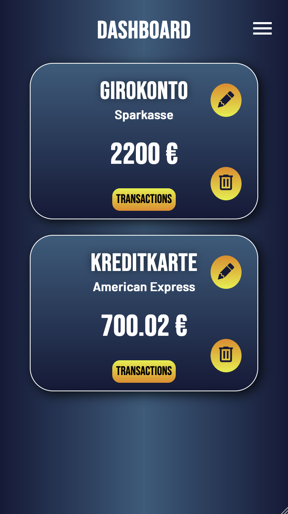
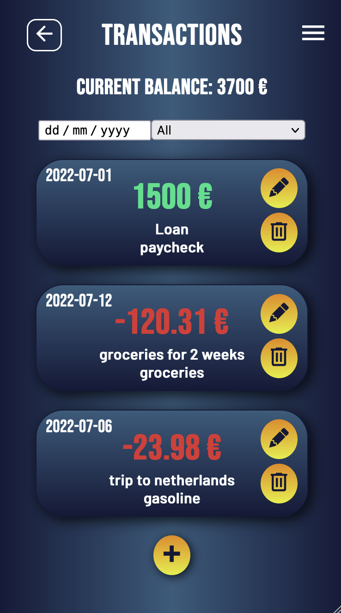
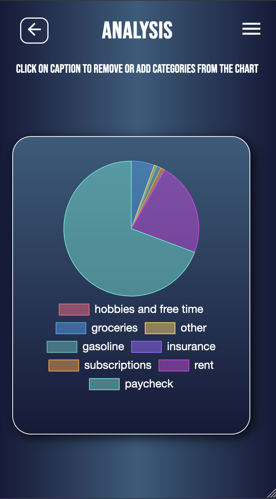

# DIGIBOOK - Capstone project

---

|                          Dashboard                          |                          Transaction                           |                          Analysis                          |
| :---------------------------------------------------------: | :------------------------------------------------------------: | :--------------------------------------------------------: |
|  |  |  |

## Description

---

With " DigiBook " you are able to track and analyze your expenses. You can add multiple bank accounts and transactions, edit them or delete them. On the "analyse"-page your transactions are filtered by categories and you are able to see, which category you spent the most money on. The app was developed in cooperation with [Dana Neuhäusel](https://github.com/dananhsl).

## Tech Stack

---

-   React
-   Javascript
-   Zustand
-   Styled Components
-   DND-Kit
-   Toastify
-   Persist
-   Charts.js

## Test Version

---

!! This app is currently optimized for mobile only !!

[You can find the test version here.](https://digibook.vercel.app/)

